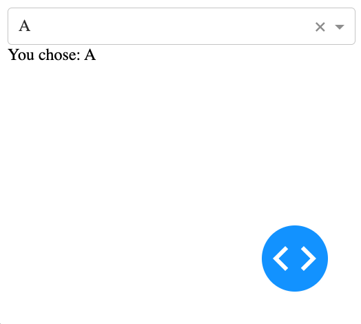
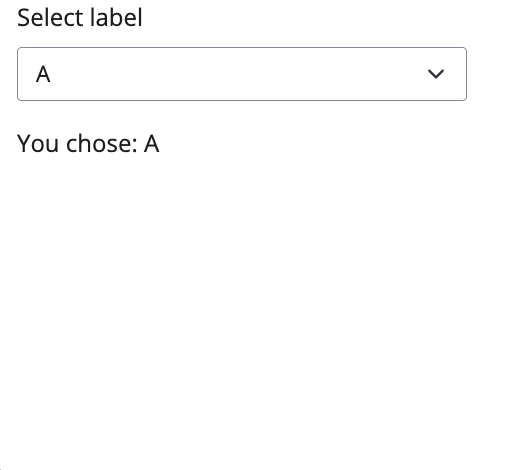
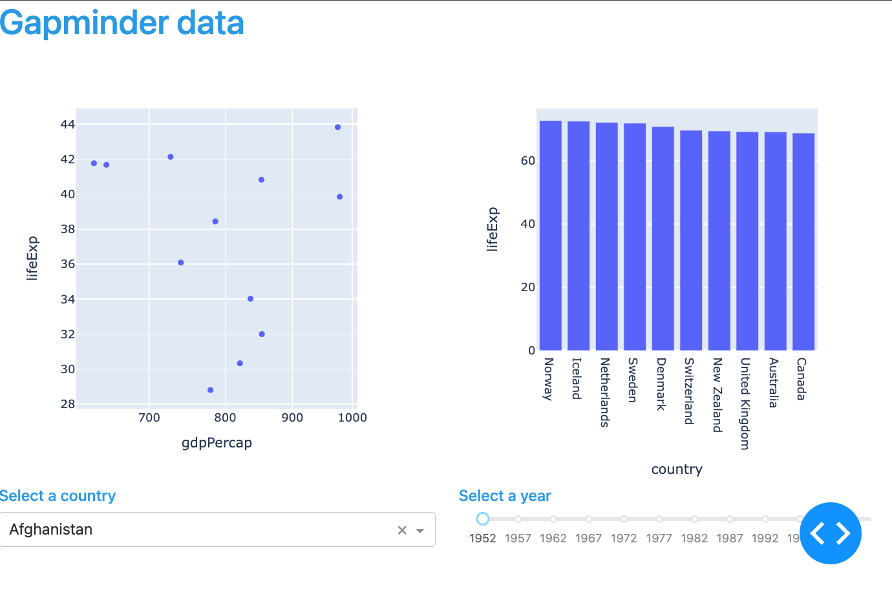
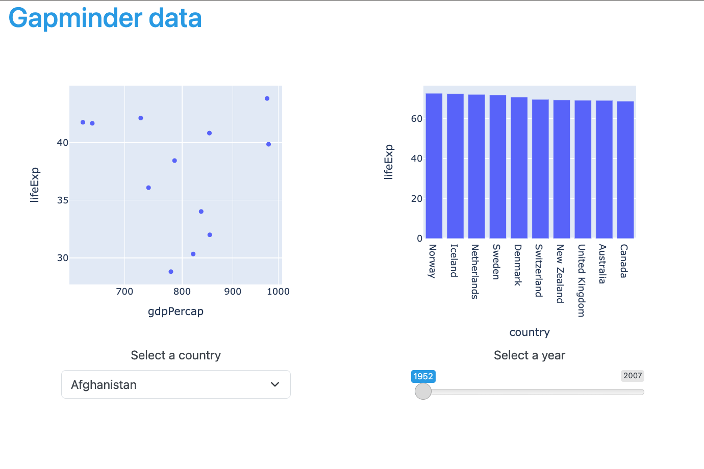

# Dash and Shiny for Python

A series of simple apps to compare the syntax, usability, and ideas for two quick web app frameworks: [Dash](https://plotly.com/dash/) and [Shiny for Python](https://shiny.posit.co/py/).

Each section has a file for the equivalent app in both Dash and Shiny.  The files are commented to add notes.  The comments assume you go through the sections in order (ie the later sections won't comment on the basics).

We're skipping making a blank page that does nothing.... boring.  Doing things is cool, not doing things is only cool irl, not in web apps.

<!-- TOC -->

- [Dash and Shiny for Python](#dash-and-shiny-for-python)
  - [Single input and output](#single-input-and-output)
  - [Rows, columns, and plots](#rows-columns-and-plots)
  - [Adam thoughts and opinions](#adam-thoughts-and-opinions)
  - [More official resources](#more-official-resources)
    - [Dash](#dash)
    - [Shiny](#shiny)
  - [Wanna contribute?](#wanna-contribute)

<!-- /TOC -->

## Single input and output

A page with a drop down menu and a text output that confirms the user's selection.

**Dash** - [`single_input_output/dash_single_input_output.py`](single_input_output/dash_single_input_output.py)

  <kbd>
  
  </kbd>

**Shiny** - [`single_input_output/shiny_single_input_output.py`](single_input_output/shiny_single_input_output.py)

  <kbd>
  
  </kbd>

## Rows, columns, and plots

A page with two plots and two inputs that filter the plots.  All four components organized using bootstrap rows and columns.

**Dash** - [`rows_cols_plots/dash_rows_cols_plots.py`](rows_cols_plots/dash_rows_cols_plots.py)

  <kbd>
  
  </kbd>

**Shiny** - [`rows_cols_plots/shiny_rows_cols_plots.py`](rows_cols_plots/shiny_rows_cols_plots.py)

  <kbd>
  
  </kbd>

## Adam thoughts and opinions

Dash seems to be a little less batteries included than Shiny.  This will give you more control in making apps exactly how you want, but takes a little extra effort to make things pretty where Shiny comes with some decent default styling.

Dash might make more intuitive sense to someone with some web knowledge already.  It puts you a little closer to the HTML.  Shiny does its best to hide some of the web dev things from you (this is a pro or a con depending on you and your fit).

Shiny being an R product with a big active community makes it hard to find the answers to your questions online.  Most every Google search you run will lead you to R code, and ChatGPT doesn't have a ton of training data on the subject to help guide.

*Disclaimer: I have an R Shiny background.*

## More official resources

### Dash

"Dash in 20 minutes1": https://dash.plotly.com/tutorial 

1times might vary

### Shiny

If you are familiar with Shiny in R, this resource is really really good: https://shiny.posit.co/py/docs/comp-r-shiny.html

This is a more ground up approach: https://shiny.posit.co/py/docs/overview.htmlhttps://dash.plotly.com/tutorial

## Wanna contribute?

Add a comparison... pls... ?

**How to**:
* Fork
* Make folder and apps
* Add a section to README.md (copy current sections format)
* Pull Request

Open an Issue if you'd like to discuss before working (ie make an issue named "add navbar example" and the discussion has started).
